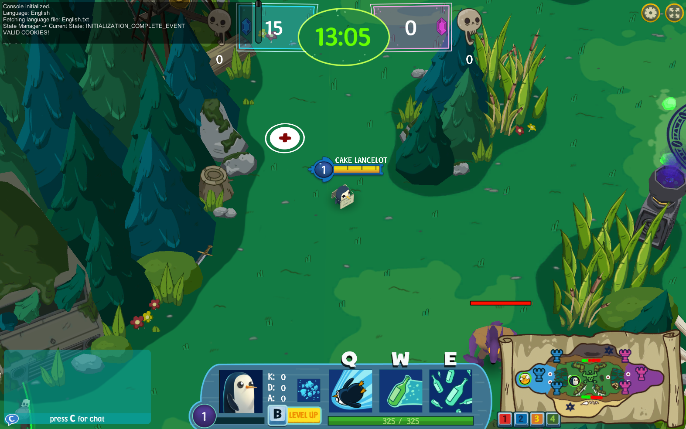

# OpenATBP

An open-source lobby, service, and game server for Adventure Time Battle Party.

## Status
Currently, a handful of characters have their full kits functional, and games can be played from start to finish. Collision, pathfinding, and a few other systems still need work. For the most up-to-date progress, check the [Trello board](https://trello.com/b/DcrsFKB1/openatbp). Contributions are always welcome!

## Server Architecture
Originally, Battle Party required several server-side components in order to to function:
* Web server to serve static content/streaming assets
* Web server that provides service/API endpoints (internal name "Facade")
* Socket policy server to satisfy the Unity Web Player [security sandbox](https://docs.unity3d.com/351/Documentation/Manual/SecuritySandbox.html)
* Lobby server for players to form parties and search for matches (internal name "DungeonServer")
* SmartFoxServer2X with custom extension acting as the actual game server

To simplify development and deployment, all but the last component have been combined into one piece of software, which is available under the `ATBPServer` directory. The SmartFoxServer2X extension lives under the `ATBPExtension` directory.

~~More in-depth explanations of each component, how the client interacts with them, and how request/response packets are structured can be found in the `docs/` folder.~~
This is unfortunately not available yet, but work is slowly being done. For the time being, feel free to reference the `dev-general` channel in [the Discord](https://discord.gg/AwmCCuAdT4), as well as decompiled client code generated via ILSpy/dnSpy.

## Development

### Prerequisites 
*Ensure these are all installed before proceeding!*
* Git
* Java Development Kit 11
* SFS2X Community Edition
* NodeJS and NPM
* MongoDB Server 

### Setting up
1. Clone the repository: `git clone https://github.com/OpenATBP/OpenATBP.git`
2. Open a new terminal inside of the `ATBPServer` directory
3. In this new terminal window, run the following command to install dependencies and download required asset files - this may take a while! `npm install`
4. Copy the example config in the ATBPServer directory: `cp config.js.example config.js` - once copied, edit it to include the connection string URI for your MongoDB server
5. Run ATBPServer using the following command: `npm run start` - if done correctly you should see `Express server running on port 8000!` and 
`Lobby server running on port 6778!`
6. Start SmartFoxServer2X once so it can generate the correct files and folders, then close it
7. Open another terminal, this time in the root of the repository
8. Run the following commands to copy necessary files, then compile the game extension: `.\gradlew ATBPExtension:copySFS2XLibs`, `.\gradlew ATBPExtension:jar`
9. Provided there weren't any errors, deploy the SmartFox extension: `.\gradlew ATBPExtension:deploy` - this will also copy the data, definition and zone file(s) if needed
10. Copy the example config in the SFS2X extension directory (SFS2X/extensions/Champions, should be right next to the jar file): `cp config.properties.example config.properties` - once copied, edit it to include the same URI string you did in step 4.
12. Start SmartFoxServer2X, you should see a log line indicating the extension is working: `ATBP Extension loaded`
13. Finally, connect to http://127.0.0.1:8000 with an NPAPI-compatible browser such as Pale Moon to test the game!

Note that you can also run any Gradle task (`gradlew` commands) graphically through an IDE such as IntelliJ IDEA or Eclipse. 

### Docker (Optional)
As an alternative to the manual setup, OpenATBP can be run using Docker.
This mirrors the manual workflow by mounting the same config files and requiring an external MongoDB instance.

Once Docker and Docker Compose are installed you can just write `docker compose up` and connect to http://127.0.0.1:8000 and you're ready to go!

These instructions are subject to change, if you run into any problems or have questions feel free to open an issue here on Github or reach out to us on [our Discord](https://discord.gg/AwmCCuAdT4).

## License
MIT unless specified otherwise

